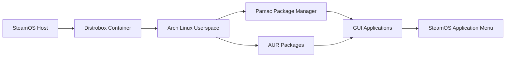

## **Native Experience Features:**

### 🖥️ **Desktop Integration**
- **Native App Menu**: Pamac appears in your Steam Deck's application menu under "System" 
- **Proper Icon & Categorization**: Shows up with the correct Pamac icon and metadata
- **Launch Like Any App**: Click and run - no terminal commands needed
- **Auto-cleanup**: When you uninstall packages, their shortcuts are automatically removed

### 🔄 **Persistent Storage**
- **Survives Updates**: Your installed packages and configurations persist through SteamOS updates
- **Build Cache**: Speeds up AUR package compilation by caching builds in `~/.cache/yay`
- **Settings Retention**: Pamac configuration and preferences are maintained

### Core Functionality
1. **Immutable Filesystem Preservation** ✅  
   - All package installations occur entirely within the Distrobox container
   - No modifications to the host SteamOS filesystem
   - SteamOS remains read-only and secure

2. **AUR Package Management** ✅  
   - Installs Pamac with full AUR support inside container
   - GUI and CLI access to Arch Linux packages + AUR
   - `yay` helper pre-installed for terminal operations

3. **Automatic Setup** ✅  
   - Single-script execution handles everything
   - Container creation
   - Pamac installation
   - System configuration
   - Application exporting

4. **Seamless Desktop Integration** ✅  
   - Pamac appears in SteamOS application menu
   - Installed apps get automatically added to menu
   - Exporting respects SteamOS .desktop standards

### Security and Safety
- **No Developer Mode Required** ✅  
  Works within standard SteamOS restrictions
- **No Sudo on Host** ✅  
  All privileged operations are containerized
- **No System Modifications** ✅  
  Leaves SteamOS core files untouched

### User Experience
- **GUI Application** ✅  
  Pamac runs as native-looking desktop app
- **Menu Integration** ✅  
  Newly installed apps appear alongside Steam games
- **Proactive Error Handling** ✅  
  Comprehensive logging and recovery mechanisms

### 🏗️ **Full Arch Linux Environment**
- **Complete Package Access**: Full Arch repos + AUR (60,000+ packages)
- **Development Tools**: Complete build environment for compiling from source
- **Gaming Packages**: Steam, Lutris, Wine, etc. without conflicts
- **System Tools**: Advanced utilities not available in SteamOS

### 🔧 **Smart Container Features**
- **Automatic Arch Updates**: Keeps your Arch environment current
- **Shared Home Directory**: Access to your Steam Deck files
- **Hardware Access**: GPU, controllers, and other devices work normally
- **Network Integration**: Shares network settings with SteamOS

## **How It Works Behind the Scenes:**

1. **Container Creation**: Creates an isolated Arch Linux environment
2. **Desktop Export**: Makes Pamac appear as a native SteamOS application
3. **File Integration**: Installed apps can create shortcuts on your desktop
4. **Cleanup Automation**: Pacman hooks ensure removed software doesn't leave orphaned shortcuts

## **User Experience:**

```bash
# Installation - Run once:
./setup-pamac.sh

# Daily usage - Just like any native app:
# 1. Open Steam menu
# 2. Navigate to "System" or "All Applications" 
# 3. Click "Pamac Manager"
# 4. Install/remove software normally
# 5. Installed apps appear in your menu automatically
```

## **Why This Approach Works Perfectly:**

- **SteamOS Compatibility**: Doesn't break during SteamOS updates
- **Performance**: Negligible overhead - apps run at native speed
- **Safety**: Can't break your Steam Deck system
- **Flexibility**: Full Linux software ecosystem available
- **Convenience**: Works exactly like a native package manager

This gives you the best of both worlds: SteamOS's gaming-optimized stability with Arch Linux's comprehensive software availability, all while maintaining the user experience of a native package manager.

# Steam-OS-Pamac

Installation command (You will need to adjust the directory path if the script is not on the desktop)

**chmod +x ~/Desktop/SteamOS-Pamac-Intaller.sh**


### Process


### Verification Test
When you run the script, you'll see this final success message:
```
🎉 SETUP COMPLETE! 🎉
Enhanced Pamac with AUR support is now installed and ready to use.

ACCESS METHODS:
  🖥️  Desktop Mode: Application Launcher → 'Pamac Package Manager'
  🛠️  Management: Use 'BoxBuddy' for advanced container operations
```

All installed applications (including those from AUR) will appear in your application menu under appropriate categories, looking and behaving like native SteamOS applications. The container provides full Arch Linux compatibility while keeping SteamOS perfectly intact.


